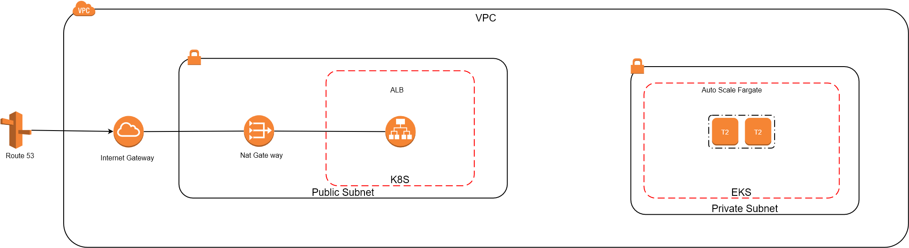

# Datasaur DevOps


## Table of Contents

- [Datasaur DevOps](#datasaur-devops)
  - [Table of Contents](#table-of-contents)
  - [Planning](#planning)
    - [AWS Ecosystem Plan](#aws-ecosystem-plan)
  - [Preparing](#preparing)
  - [Setup Docker](#setup-docker)
    - [Initial Image](#initial-image)
    - [Build Caching](#build-caching)
  - [Provisioning](#provisioning)
  - [Setup CI-CD](#setup-ci-cd)
  - [Monitoring](#monitoring)
    - [Setup Kubectl](#setup-kubectl)
    - [Accessing Grafana](#accessing-grafana)
    - [Accessing Prometheus](#accessing-prometheus)
  - [Cleaning up](#cleaning-up)

## Planning

### AWS Ecosystem Plan


This repository use the following plan, we are going to deploy Amazon EKS with Serverless Fargate. on The front we use route 53 to point our DNS name to the Cluster. Read 
[Route 53 Documentation](https://docs.aws.amazon.com/Route53/latest/DeveloperGuide/migrate-dns-domain-in-use.html) about migrating your own domain.

## Preparing
Before we move forward, these are required package to install and configure:

- [awscli](https://aws.amazon.com/cli/)
- [kubectl](https://kubernetes.io/docs/tasks/tools/)
- [helm](https://helm.sh/docs/)
- [terraform](https://www.terraform.io/docs/index.html)
- [docker](https://docs.docker.com/docker-for-windows/install/)

If you are using windows I recommend using [choco](https://chocolatey.org/install) to install all the required package.


## Setup Docker

### Initial Image

Edit Dockerfile inside the NestJS project directory to:
```Dockerfile
FROM node:lts-alpine3.13
WORKDIR /app
COPY ./package.json ./
RUN npm install
COPY . .
RUN npm run build
EXPOSE 3000
CMD ["npm", "run", "start:prod"]
```
Then run command:
```cmd
cd <YOUR PROJECT DIRECTORY>
docker login
docker build -t <USERNAME>/<YOUR ARTIFACT NAME> .
docker push <USERNAME>/<YOUR ARTIFACT NAME>
```

### Build Caching
Edit Dockerfile inside the NestJS project directory to:
```Dockerfile
FROM <USERNAME>/<YOUR ARTIFACT NAME>:latest
WORKDIR /app
COPY ./package.json ./
RUN npm install
COPY . .
RUN npm run build
EXPOSE 3000
CMD ["npm", "run", "start:prod"]
```
**only do this after you push your initial image**
## Provisioning

Before running terraform, create new tfvars file inside folder infrastructure using this template:
```json
region                      = 
vpc_name                    = 
vpc_cidr                    = "10.2.0.0/16"
eks_cluster_name            = 
cidr_block_igw              = "0.0.0.0/0"
node_group_name             = 
ng_instance_types           = [ "t2.small" ]
disk_size                   = 10
desired_nodes               = 2
max_nodes                   = 2
min_nodes                   = 1
fargate_profile_name        = 
kubernetes_namespace        = 
deployment_name             = 
deployment_replicas         = 
domain_name                 = 
grafana_password            = "admin"
docker_image                = "symefa/datasaur-symefa:latest"
app_domain                  =
app_labels = { 
    "app" = 
    "tier" = 
}
```

| Name                 	| Description                                	| Recommended   	|
|----------------------	|--------------------------------------------	|---------------	|
| `region`             	| Your AWS region                            	|               	|
| `vpc_name`            | VPC instance name                          	|               	|
| `vpc_cidr`            | VPC Classless Inter-Domain Routing         	| "10.2.0.0/16" 	|
| `eks_cluster_name`    | Kubernetes cluster name                    	|               	|
| `cidr_block_igw`      |                                            	| "0.0.0.0/0"   	|
| `node_group_name`     | Name for node group                        	|               	|
| `ng_instance_types`   | EC2 Instance type                          	| ["t2.small"]  	|
| `disk_size`           | Size of allocated storage                  	|               	|
| `desired_nodes`       | Number of preferred node                   	|               	|
| `max_nodes`           | Maximum amount of node                     	|               	|
| `min_nodes`           | Minimum amount of node                     	|               	|
| `fargate_profile_name`| Fargate instance name                      	|               	|
| `kubernetes_namespace`| Namespace for application tobe deployed to 	|               	|
| `deployment_name`     | Name of deployment                         	|               	|
| `deployment_replica`  | Number of deployment                       	|               	|
| `domain_name`         | Your domain name                           	|               	|
| `grafana_password`    | Password for grafana                       	|               	|
| `app_labels`          | Set name of the apps and tier              	|               	|
| `docker_image`        | dockerhub image to be deployed             	|               	|
| `app_domain`          | Full application domain name         	        |               	|

after your create configuration file run:
```cmd
cd infrastructure
terraform init
terraform plan -var-file=<your tfvars file>
terraform apply -var-file=<your tfvars file>
```

your application will be accessible from komodo."yourdomain". edit the `main.tf` inside the infrastructure folder to change

## Setup CI-CD
Edit .github/workflows/main.yml using configuration from your terraform to:

```yml
name: CI-CD
env:
  NAMESPACE: <namespace name>
  DEPLOYMENT: <deployment name>-datasaur
  REGION: <region name>
  CLUSTER_NAME: <cluster name>
#ommited file
```
note this implementation using rollout strategy, changes will be applied after 1-2 minutes.

## Monitoring

### Setup Kubectl
Use this command:
```cmd
aws eks --region <region-code> update-kubeconfig --name <cluster_name>
kubectl get svc
```
if its returns your list of service then kubectl was configured successfully.

### Accessing Grafana
Run this command:
```cmd
kubectl port-forward -n monitoring svc/grafana 9000:80
```
Then click this [Grafana](localhost:9000). Login using:
```txt
USERNAME=admin
PASSWORD=<your grafana password>
```
To view default dashboard, import file "grafana-dashboard.js" inside the infrastructure folder.

### Accessing Prometheus
Run this command:
```cmd
kubectl port-forward -n monitoring svc/prometheus 8081:80
```
Then click this [Prometheus](localhost:8081)

## Cleaning up

You can destroy this cluster and vpc entirely by running:

```cmd
terraform destroy
```

```
infrastructure
├───modules
│   ├───dns
│   ├───eks
│   │   ├───eks_cluster
│   │   ├───eks_node_group
│   │   └───fargate
│   ├───kubernetes
│   ├───monitoring
│   │   └───data
│   └───network
...
```

***wild kawai komodo dragon appears!!***
